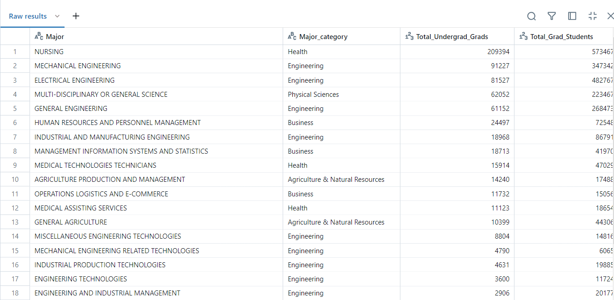
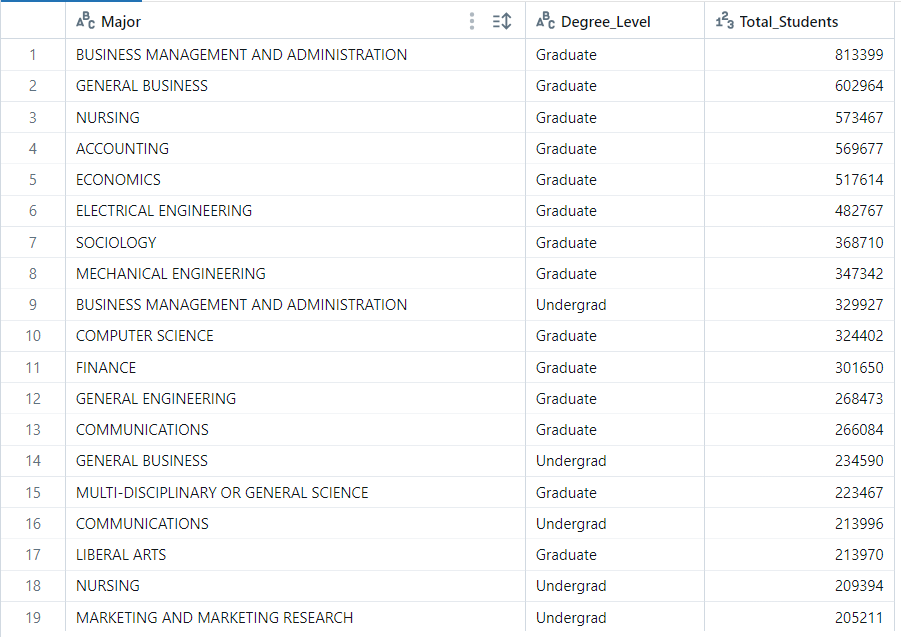

[](https://github.com/nogibjj/Mobasserul_Haque_MiniProject5/actions/workflows/cicd.yml)

# Graduate Employment Salary ETL Query Pipeline using Databricks

This project provides an ETL (Extract, Transform, Load) and querying tool designed to analyze critical employment statistics for both undergraduate and graduate students. The analysis focuses on employment rates, unemployment rates, and salary premiums, leveraging data from the **RecentGradsDB** and **GradStudentsDB** datasets.

The pipeline is built using Python and Databricks, offering users the capability to efficiently extract data from various sources, transform and clean it for analysis, and load it into a Databricks table for further processing. Users can perform complex SQL queries that utilize JOINs, aggregations, filtering, and sorting to gain insights into employment trends, average salaries, and the effectiveness of various degree programs in securing employment for graduates.

By utilizing this pipeline, educators, policymakers, and students can better understand the labor market dynamics and the value of different degrees, ultimately aiding in informed decision-making regarding education and career paths.

## Features

- **ETL Operations**: 
  - Extract data from CSV files.
  - Transform and load data into Databricks tables for analysis.
  
- **Data Transformation**: Cleaning and preprocessing of data to ensure consistency and accuracy, including handling missing values and converting data types.

- **Data Loading**: Efficient loading of transformed data into a Databricks table, enabling scalable querying and analysis.

- **Query Operations**:
  - Execute complex SQL queries using JOINs, GROUP BY, HAVING, and UNION.
  - Filter and sort data by employment rates, salary differences, and other attributes.
  
- **Logging and Output**:
  - Query results are outputted in a structured format for easy interpretation.
  - Errors and exceptions are logged during ETL and querying processes.

## Directory Structure

```
├── .devcontainer/
│   ├── devcontainer.json
│   └── Dockerfile
├── .github/
│   └── workflows/cicd.yml
├── data/
│   ├── grad-students.csv
    └── recent_grads.csv
├── myLib/
│   ├── __init__.py
│   ├── __pycache__/
│   ├── extract.py
│   ├── query.py
│   └── transform_load.py
├── .gitignore
├── main.py
├── Makefile
├── query_log.md
├── README.md  
├── requirements.txt
└── test_main.py
```
## Usage
To run the ETL process or execute queries, use the following commands:

### Extract Data
To extract data from the CSV files, run:

```python
python main.py extract
```
### Load Data
To transform and load data into the Databricks database, execute:
```python
python main.py load
```

### Load Data
To transform and load data into the Databricks database, execute:
```python
python main.py load
```
## Execute SQL Query
To run a SQL query against the Databricks database, use:

```python
python main.py query "<your_sql_query>"
```

## Complex SQL query 1:

```sql
SELECT 
    rg.Major, 
    rg.Major_category, 
    rg.Total AS Total_Undergrad_Grads, 
    gs.Grad_total AS Total_Grad_Students, 
    AVG(rg.Unemployment_rate) AS Avg_Undergrad_Unemployment_Rate, 
    AVG(gs.Grad_unemployment_rate) AS Avg_Grad_Unemployment_Rate, 
    AVG(rg.Median) AS Avg_Undergrad_Median_Salary, 
    AVG(gs.Grad_median) AS Avg_Grad_Median_Salary 
FROM 
    RecentGradsDB rg 
JOIN 
    GradStudentsDB gs 
ON 
    rg.Major_code = gs.Major_code 
GROUP BY 
    rg.Major_category, 
    rg.Major, 
    rg.Total, 
    gs.Grad_total 
HAVING 
    AVG(rg.Unemployment_rate) < 0.06 
ORDER BY 
    rg.Total DESC;

```
This SQL query joins two tables, RecentGradsDB and GradStudentsDB, and retrieves aggregate information about undergraduate and graduate employment, salary statistics, and unemployment rates for different majors

The query provides a list of majors along with details such as the total number of undergraduate and graduate students, the average unemployment rates, and the average median salaries for both undergraduate and graduate levels. The results are filtered to include only majors where the average undergraduate unemployment rate is below 6%, and the majors are sorted by the total number of undergraduates in descending order

### Expected output:

This output highlights majors with low unemployment rates and the comparison between undergraduate and graduate outcomes



## Complex SQL query 2:

```sql

SELECT Major, 'Undergrad' AS Degree_Level, Total AS Total_Students 
FROM RecentGradsDB 
WHERE Total > 5000 
UNION 
SELECT Major, 'Graduate' AS Degree_Level, Grad_total AS Total_Students 
FROM GradStudentsDB 
WHERE Grad_total > 5000 
ORDER BY Total_Students DESC;

```

This SQL query combines data from two different tables (`RecentGradsDB` and `GradStudentsDB`) to show majors that have more than 5,000 students at both undergraduate and graduate levels, and it orders the results by the total number of students in descending order.

`SELECT` statement Part1 (**Undergraduate data**):

-Retrieves the Major, assigns the string `'Undergrad'` to the Degree_Level, and selects the total number of undergraduate students (Total) from the `RecentGradsDB` table.

-**Filters** (`WHERE Total > 5000`) to include only majors with more than 5,000 undergraduate students.

`SELECT` statement Part2 (Graduate data):

-Retrieves the Major, assigns the string `'Graduate'` to the Degree_Level, and selects the total number of graduate students (Grad_total) from the `GradStudentsDB` table.

-**Filters** (`WHERE Grad_total > 5000`) to include only majors with more than 5,000 graduate students.

`UNION` operator:

Combines the results from the two SELECT statements, ensuring that any duplicates are removed. 

`ORDER BY` Total_Students DESC:

Orders the combined result set by the total number of students (Total_Students) in descending order, showing majors with the highest total first.

### Expected output:

The output consists of a combined and sorted list of majors that have more than 5,000 students, with each entry labeled according to the degree level. The majors are ordered by the total number of students, showing those with the highest student counts first.



## Testing
run below command to test the script
```python
pytest test_main.py
```

## References 
1. https://github.com/nogibjj/sqlite-lab
2. https://learn.microsoft.com/en-us/azure/databricks/dev-tools/python-sql-connector